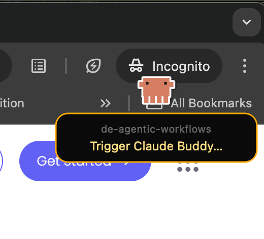

# Claude Buddy

An always-on-top approval widget for Claude Code on macOS.

When Claude Code requests tool permissions, instead of switching to the terminal to approve or deny, a floating chip appears at the top-right of your screen showing the risk level and plain-English description of what Claude is about to do.



## Features

* Floating chip stays visible across all virtual desktops
* Risk levels: low (green), medium (yellow), high (red)
* Plain-English intent -- know what Claude is actually doing before you approve
* Approve, Deny, or jump directly to the terminal session
* Supports multiple simultaneous Claude Code sessions

## Requirements

* macOS
* Python 3.6+
* PyQt6 (`pip install PyQt6`)

## Setup

**1. Clone the repo**
```bash
git clone https://github.com/aviaddantz/claude-buddy.git ~/Development/nudge
```

**2. Install dependencies**
```bash
pip install PyQt6
```

**3. Add hooks to `~/.claude/settings.json`**
```json
{
  "hooks": {
    "SessionStart": [{"command": "bash ~/Development/nudge/start-daemon.sh"}],
    "PermissionRequest": [{"command": "bash ~/Development/nudge/notify.sh approval"}],
    "Stop": [{"command": "bash ~/Development/nudge/notify.sh done"}]
  }
}
```

**4. Start Claude Code** -- the widget launches automatically.

## Manual controls

```bash
python3 ~/Development/nudge/buddy.py daemon  # start manually
python3 ~/Development/nudge/buddy.py show
python3 ~/Development/nudge/buddy.py hide
```

Logs: `/tmp/claude-buddy.log`

## How it works

Two processes talk via Unix socket and named pipes:

* `notify.sh` -- reads the permission request from Claude Code, classifies the tool into a risk level and intent string, sends it to the daemon
* `buddy.py` -- runs the UI, displays the chip, writes the approve/deny decision back

## Contributing

PRs welcome. Open an issue first for anything beyond small fixes.
