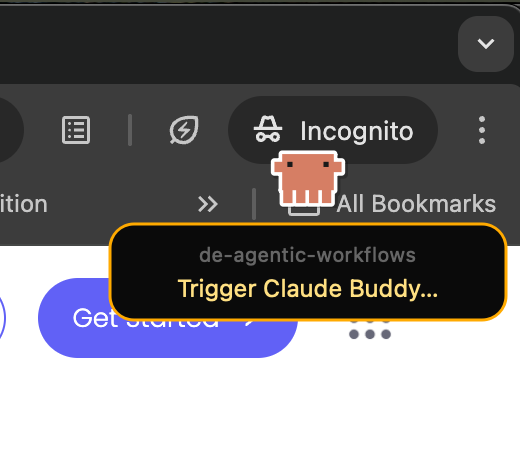

# Nudge

An always-on-top approval widget for Claude Code on macOS. When Claude Code requests tool permissions, a floating chip appears at the top-right of your screen showing the risk level and a plain-English description of what Claude is about to do — no terminal switching required.



## Features

* Floating chip visible across all virtual desktops
* Risk levels: low (green), medium (yellow), high (red)
* Plain-English intent — know what Claude is doing before you approve
* Approve, Always Allow, Deny, or jump to the terminal session
* Auto-approves low-risk operations (reads, fetches, ls) — configurable
* Thinking state: Claude sprite bobs on a rope while processing — rope stays live across the full agentic session
* Menu bar app for Pause/Resume, Restart, Always Show, and Launch at Login
* Supports multiple simultaneous Claude Code sessions

## Requirements

* macOS 13+
* Python 3.6+
* PyQt6: `pip install PyQt6`
* Xcode Command Line Tools: `xcode-select --install`

## Install

```bash
git clone https://github.com/aviaddantz/claude-buddy.git ~/Development/nudge
pip install PyQt6

# Build the menu bar app
cd ~/Development/nudge/NudgeApp
bash bundle.sh

# Install to /Applications
cp -r Nudge.app /Applications/
open /Applications/Nudge.app
```

Add the Nudge hooks to `~/.claude/settings.json`:

```json
{
  "hooks": {
    "SessionStart":      [{ "type": "command", "command": "bash ~/Development/nudge/notify.sh session_start" }],
    "SessionEnd":        [{ "type": "command", "command": "bash ~/Development/nudge/notify.sh session_end" }],
    "UserPromptSubmit":  [{ "type": "command", "command": "bash ~/Development/nudge/notify.sh thinking_start" }],
    "PreToolUse":        [{ "type": "command", "command": "bash ~/Development/nudge/notify.sh thinking_start" }],
    "Stop":              [{ "type": "command", "command": "bash ~/Development/nudge/notify.sh thinking_stop" }],
    "PermissionRequest": [{ "type": "command", "command": "bash ~/Development/nudge/notify.sh approval" }]
  }
}
```

Nudge.app starts the daemon on launch and registers itself as a Login Item so the daemon starts automatically at login. The `SessionStart` hook also ensures the daemon is running at the start of each Claude Code session.

## Menu bar

Click the Nudge icon in the menu bar to:

* **Pause / Resume** — stop or restart the daemon
* **Restart** — restart the daemon
* **Test Nudge** — fire a test pill to verify everything is working
* **Auto-approve safe operations** — toggle silent approval for low-risk tools (reads, fetches, ls). On by default.
* **Always show** — keep the widget visible at all times (thinking state and idle), not just when an approval is pending.
* **Launch at Login** — register Nudge.app as a Login Item

## How it works

**Approval flow** (PermissionRequest):
```
Claude Code  →  PermissionRequest hook  →  notify.sh  →  Unix socket  →  buddy.py daemon
                                                                                  ↓
                                                              named pipe  ←  chip widget
```

`notify.sh` reads the permission request, classifies the tool into a risk level and intent string, and sends it to the daemon. The daemon shows the chip. On Approve/Deny the decision is written back to Claude Code via the named pipe.

Low-risk tools (reads, fetches, ls, grep) are auto-approved by `notify.sh` without reaching the daemon, unless auto-approve is disabled in the menu bar.

**Thinking state** (rope animation):
```
UserPromptSubmit / PreToolUse  →  notify.sh thinking_start  →  daemon  →  rope animation
Stop                           →  notify.sh thinking_stop   →  daemon  →  animation stops
```

When Claude starts processing (`UserPromptSubmit`) and before each tool call (`PreToolUse`), the sprite bobs on a rope. `PreToolUse` acts as a keepalive so the rope stays continuous across multi-step agentic sessions. `Stop` fires after each response, stopping the animation. `SessionEnd` cleans up session state.

Logs: `/tmp/claude-buddy.log`

## Manual controls

```bash
bash ~/Development/nudge/start-daemon.sh   # start daemon
bash ~/Development/nudge/stop-daemon.sh    # stop daemon
```

## Rebuilding after Swift changes

The standard `swift build` is broken on CLT 16.4 due to a SwiftBridging redefinition bug. Always use `bundle.sh` directly:

```bash
cd ~/Development/nudge/NudgeApp
bash bundle.sh
cp -r Nudge.app /Applications/
```

## Uninstall

```bash
rm -rf /Applications/Nudge.app
rm ~/.nudge-autoapprove-disabled 2>/dev/null
# Remove the PermissionRequest hook from ~/.claude/settings.json
```
